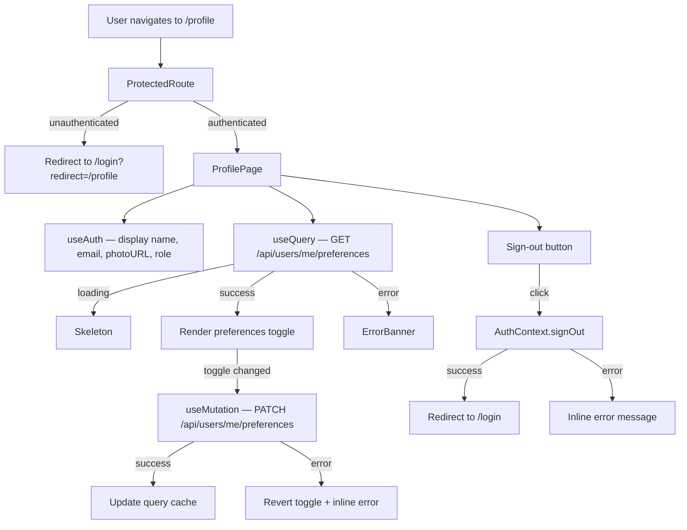

# Design Document

## User Profile Page

---

## Overview

The User Profile page (`/profile`) is a new protected route rendered inside the existing `AppShell` layout. It gives every authenticated CareBridge user a single place to view their identity information (display name, email, avatar), understand their assigned role, manage notification preferences, and sign out.

The page is intentionally read-only for identity data — CareBridge delegates identity management to Firebase Auth and does not allow users to edit their display name or email from within the app. The only mutable state on the page is the notification preferences toggle, which is persisted to the backend via a dedicated API endpoint.

The design reuses all existing infrastructure: `AuthContext` for identity and auth actions, `apiClient` for authenticated HTTP calls, `@tanstack/react-query` for data fetching and cache management, and Tailwind CSS for styling consistent with the rest of the application.

---

## Architecture

The feature introduces three new files and modifies two existing ones:

```
src/
  pages/
    ProfilePage.tsx          ← new: the /profile route component
  components/
    RoleBadge.tsx            ← new: role-coloured badge (reusable)
    ProfileAvatar.tsx        ← new: avatar with initials fallback (reusable)
  lib/
    queryKeys.ts             ← modified: add userProfile query key
  App.tsx                    ← modified: add /profile route
src/
  contexts/
    AuthContext.tsx           ← unmodified (consumed as-is)
  components/
    AppShell.tsx             ← modified: add profile entry point to sidebar footer and mobile header
```

### Data Flow



---

## Components and Interfaces

### `ProfilePage` (`src/pages/ProfilePage.tsx`)

The top-level page component. Reads identity from `useAuth()` and preferences from a React Query query. Renders four logical sections:

1. **Profile header** — avatar, display name, email, role badge
2. **Notification preferences** — toggle card
3. **Sign-out** — button with error handling
4. **Loading / error states** — skeleton while `AuthContext.loading` is true; redirect if user is null after loading

```typescript
// Internal state
const [signOutError, setSignOutError] = useState<string | null>(null)

// Auth
const { user, role, loading, signOut } = useAuth()

// Preferences query
const { data: prefs, isLoading: prefsLoading } = useQuery<UserPreferences>({
  queryKey: queryKeys.userProfile(),
  queryFn: () => apiClient<UserPreferences>('/api/users/me/preferences'),
  enabled: Boolean(user),
})

// Preferences mutation
const prefsMutation = useMutation({
  mutationFn: (patch: Partial<UserPreferences>) =>
    apiClient<UserPreferences>('/api/users/me/preferences', {
      method: 'PATCH',
      body: JSON.stringify(patch),
    }),
  onMutate: async (patch) => { /* optimistic update */ },
  onError: (_err, _patch, context) => { /* rollback + show error */ },
  onSuccess: (data) => { /* update cache */ },
})
```

### `RoleBadge` (`src/components/RoleBadge.tsx`)

A small, self-contained badge component that renders a `UserRole` with a distinct colour per role and an `aria-label` for screen readers.

```typescript
interface RoleBadgeProps {
  role: UserRole
  className?: string
}
```

Role colour mapping (all meet WCAG 4.5:1 contrast on white):

| Role | Background | Text | Token |
|---|---|---|---|
| `admin` | `purple-100` | `purple-800` | distinct from nurse/physician |
| `nurse` | `blue-100` | `blue-800` | distinct from admin/physician |
| `physician` | `green-100` | `green-800` | distinct from admin/nurse |

The badge renders visible text (the role name, capitalised) and an `aria-label` of the form `"Role: admin"` so screen readers receive the role without relying on colour alone.

### `ProfileAvatar` (`src/components/ProfileAvatar.tsx`)

Renders either a `` (when `photoURL` is present and loads successfully) or a `<span>` containing the user's initials (fallback). Handles `onError` on the `` to switch to the initials fallback if the image URL is broken.

```typescript
interface ProfileAvatarProps {
  photoURL: string | null
  displayName: string | null
  size?: 'sm' | 'md' | 'lg'  // defaults to 'md'
}
```

Initials extraction logic:
- Split `displayName` on whitespace
- Take the first character of the first and last word (uppercased)
- If `displayName` is null or empty, fall back to `"?"` 

### `AppShell` modifications

The existing `AppShell` gains a profile entry point in two locations:

**Desktop sidebar footer** (≥1280 px): Replaces the current plain "Sign Out" button with a two-part footer — a `NavLink` to `/profile` (or `/profile?demo=true` in demo mode) containing a `ProfileAvatar` and the user's display name, plus a separate sign-out icon button. The `NavLink` receives the same active-state class logic as the existing `NAV_LINKS`.

**Mobile header** (<1280 px): Adds a `NavLink` to `/profile` in the right-hand header area, rendering a small `ProfileAvatar`. The existing "Sign Out" button in the mobile header is retained alongside it.

---

## Data Models

### `UserPreferences`

A new type added to `src/types/index.ts`:

```typescript
export interface UserPreferences {
  escalationNotifications: boolean
}
```

This is the shape returned by `GET /api/users/me/preferences` and accepted by `PATCH /api/users/me/preferences`.

### Query key addition to `queryKeys.ts`

```typescript
userProfile: () => ['users', 'me', 'preferences'] as const,
```

### Optimistic update context

The preferences mutation uses React Query's `onMutate` / `onError` rollback pattern (already used elsewhere in the codebase) to provide instant UI feedback while the PATCH is in flight:

```typescript
onMutate: async (patch) => {
  await queryClient.cancelQueries({ queryKey: queryKeys.userProfile() })
  const previous = queryClient.getQueryData<UserPreferences>(queryKeys.userProfile())
  queryClient.setQueryData(queryKeys.userProfile(), (old: UserPreferences) => ({
    ...old,
    ...patch,
  }))
  return { previous }
},
onError: (_err, _patch, context) => {
  if (context?.previous) {
    queryClient.setQueryData(queryKeys.userProfile(), context.previous)
  }
  // set inline error state
},
onSettled: () => {
  queryClient.invalidateQueries({ queryKey: queryKeys.userProfile() })
},
```

---

## Correctness Properties

*A property is a characteristic or behavior that should hold true across all valid executions of a system — essentially, a formal statement about what the system should do. Properties serve as the bridge between human-readable specifications and machine-verifiable correctness guarantees.*

The project uses **fast-check** (already installed as `@fast-check/vitest`) for property-based testing with **Vitest** as the test runner.

### Property 1: Profile page displays the authenticated user's identity data

*For any* authenticated user with any display name and email address, the Profile_Page SHALL render both the display name and the email address sourced from `Auth_Context`, and SHALL NOT render any other user's display name or email.

**Validates: Requirements 1.1, 1.2, 2.5**

### Property 2: Avatar image alt text contains the display name

*For any* authenticated user with a non-null `photoURL` and any display name, the rendered avatar `` element SHALL have a non-empty `alt` attribute that contains the user's display name.

**Validates: Requirements 1.3**

### Property 3: Initials fallback is derived from the display name

*For any* authenticated user with no `photoURL` and any non-empty display name, the Profile_Page SHALL render a fallback avatar whose visible text equals the initials extracted from the display name (first character of first word + first character of last word, uppercased).

**Validates: Requirements 1.4, 5.3**

### Property 4: Role badge renders distinct styles for each role

*For any* two distinct `UserRole` values, the rendered `RoleBadge` components SHALL have different CSS class strings, ensuring each role is visually distinguishable from the others.

**Validates: Requirements 1.6, 1.7, 1.8**

### Property 5: Role badge exposes role name to screen readers

*For any* `UserRole` value, the rendered `RoleBadge` SHALL have an `aria-label` attribute whose value contains the role name, so screen readers can convey the role without relying on colour.

**Validates: Requirements 7.5**

### Property 6: Sign-out error messages are displayed inline

*For any* error thrown by `AuthContext.signOut`, the Profile_Page SHALL display the error's message text in an inline error region and SHALL NOT navigate away from `/profile`.

**Validates: Requirements 3.3**

### Property 7: Notification preference round-trip preserves value

*For any* boolean value of `escalationNotifications`, if the preference is saved successfully and the page is re-rendered with the API response, the toggle SHALL reflect the saved value.

**Validates: Requirements 6.3**

### Property 8: Failed preference save reverts toggle and shows error

*For any* initial toggle state and any error thrown by the PATCH preferences API, the Profile_Page SHALL revert the toggle to its pre-mutation state and SHALL display an inline error message.

**Validates: Requirements 6.4**

---

## Error Handling

| Scenario | Behaviour |
|---|---|
| `AuthContext.loading === true` | Render skeleton cards in place of profile content |
| `AuthContext.user === null` after loading | Redirect to `/login` (handled by `ProtectedRoute`) |
| Avatar `` `onError` fires | Switch to initials fallback; no broken image shown |
| `GET /api/users/me/preferences` fails | Show `ErrorBanner` with retry; toggle section hidden |
| `PATCH /api/users/me/preferences` fails | Rollback optimistic update; show inline error below toggle; re-enable toggle |
| `AuthContext.signOut` throws | Show inline error message below sign-out button; stay on `/profile` |
| Unauthenticated access to `/profile` | `ProtectedRoute` redirects to `/login?redirect=%2Fprofile` |

All error messages are rendered in `role="alert"` regions so screen readers announce them immediately.

---

## Testing Strategy

### Unit / Example-Based Tests (`src/tests/profilePage.test.tsx`)

These cover specific scenarios and edge cases:

- **Requirement 1.5** — Role badge is visible for each of the three roles (three example tests)
- **Requirement 2.1** — Unauthenticated visitor is redirected to `/login?redirect=%2Fprofile`
- **Requirements 2.2–2.4** — All three roles see the full profile view
- **Requirement 3.1** — Clicking sign-out calls `AuthContext.signOut`
- **Requirement 3.2** — Successful sign-out redirects to `/login`
- **Requirements 4.1–4.5** — AppShell profile entry point renders in sidebar footer and mobile header, navigates to `/profile`, shows active state, appends `?demo=true` in demo mode
- **Requirements 5.1** — Loading skeleton renders while `AuthContext.loading` is true
- **Requirement 6.1** — Notification preferences section with toggle is present
- **Requirement 6.2** — Toggling the switch calls `PATCH /api/users/me/preferences`
- **Requirement 6.5** — Toggle is disabled while PATCH is in flight
- **Requirements 7.1–7.4** — Single `<h1>`, focusable controls, `aria-live` region on toggle change

### Property-Based Tests (`src/tests/profilePage-pbt.test.tsx`)

Uses `@fast-check/vitest` with a minimum of 100 iterations per property:

| Test | Property | Generator |
|---|---|---|
| PBT 1 | Profile displays authenticated user's identity | `fc.record({ displayName: fc.string(), email: fc.emailAddress() })` |
| PBT 2 | Avatar alt text contains display name | `fc.record({ photoURL: fc.webUrl(), displayName: fc.string({ minLength: 1 }) })` |
| PBT 3 | Initials fallback derived from display name | `fc.string({ minLength: 1 })` (split on whitespace) |
| PBT 4 | Role badge distinct styles per role | `fc.uniqueArray(fc.constantFrom('admin', 'nurse', 'physician'), { minLength: 2, maxLength: 2 })` |
| PBT 5 | Role badge aria-label contains role name | `fc.constantFrom('admin', 'nurse', 'physician')` |
| PBT 6 | Sign-out error displayed inline | `fc.string({ minLength: 1 })` (error message) |
| PBT 7 | Preference round-trip preserves value | `fc.boolean()` |
| PBT 8 | Failed preference save reverts toggle | `fc.record({ initial: fc.boolean(), errorMsg: fc.string({ minLength: 1 }) })` |

Each test is tagged with:
```
// Feature: user-profile-page, Property N: <property text>
```

### Integration Considerations

- The `GET /api/users/me/preferences` and `PATCH /api/users/me/preferences` endpoints are mocked in all unit and property tests using `vi.mock('@/lib/apiClient')`.
- Firebase Auth is mocked via the existing pattern in the test suite (`vi.mock('firebase/auth')`, `vi.mock('@/lib/firebase')`).
- No real network calls are made in any automated test.
